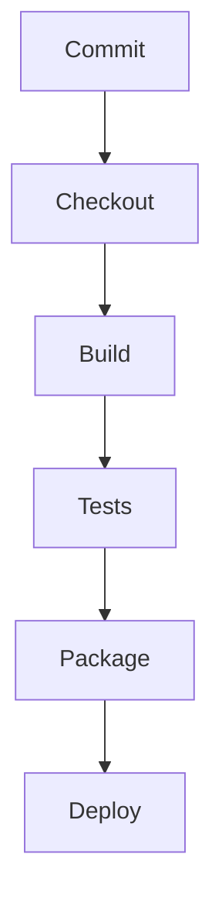

# Jenkins Pipeline Demo

This repository contains a minimal Java application with a more detailed Jenkins
Pipeline. It shows a typical CI/CD flow using Maven and JUnit.

## Project Structure

```
.
├── Jenkinsfile           # Jenkins Pipeline definition
├── pom.xml               # Maven build file
└── src
    ├── main
    │   └── java/com/example/App.java
    └── test
        └── java/com/example/AppTest.java
```

## About the Code

The application is intentionally simple so the focus remains on the Jenkins
pipeline. `App.java` contains a `main` method that prints a greeting:

```java
public class App {
    public static void main(String[] args) {
        System.out.println("Hello from Jenkins CI/CD pipeline");
    }
}
```

`AppTest` provides a trivial JUnit test asserting `true`. Despite its
simplicity, it demonstrates how Maven runs tests inside the pipeline.

## Jenkins Pipeline Overview

The pipeline defined in `Jenkinsfile` performs the following stages:

1. **Checkout** – pulls the source code from SCM.
2. **Build** – compiles the Java sources using Maven.
3. **Unit Test** – runs JUnit tests and publishes the results.
4. **Package** – packages the application into a JAR (tests are skipped here to speed up packaging).
5. **Archive Artifact** – archives the generated JAR in Jenkins.

Additional pipeline options include keeping the last 10 builds, preventing
concurrent runs, and timestamping the log output.

## Running Locally

To build and test the project locally, you need JDK 11 and Maven installed:

```bash
mvn clean verify
```

This will compile the application, run the tests, and package the JAR file
under `target/`.

## Setting Up the Jenkins Pipeline

1. **Install Jenkins** – Download the [Jenkins LTS](https://www.jenkins.io/) release and run it on a server. Make sure Java 11 is available on the host.
2. **Install Required Plugins** – From the Jenkins dashboard, navigate to **Manage Jenkins → Plugins** and install:
   - **Pipeline** (for Jenkinsfile support)
   - **Git** (for checking out the code)
   - **JUnit** (for test result reporting)
   - **Credentials** (for securely storing secrets)
3. **Configure Global Tools** – Under **Manage Jenkins → Global Tool Configuration**, define the `JDK11` and `Maven3` tool installations used in the pipeline.
4. **Create a Pipeline Job** – Create a new **Pipeline** project and point it to this repository. Jenkins will automatically detect the `Jenkinsfile` and execute the stages on each build.
5. **Configure Build Agents** – If you have multiple agents, label them appropriately and set the `agent` directive in the `Jenkinsfile` to match. In this demo we use `agent any` to run on any available agent.

## Securing the Pipeline

1. **Enable Global Security** – Go to **Manage Jenkins → Configure Global Security** and enable authentication. Use a strong admin password and create individual user accounts.
2. **Restrict Job Permissions** – Use the **Matrix Authorization Strategy** to allow only trusted users to configure or run jobs.
3. **Store Secrets in Credentials** – Add credentials (such as Git or artifact repository credentials) using Jenkins **Credentials** store. Reference them in the pipeline with the `credentials()` function instead of hardcoding passwords.
4. **Use Agents with Limited Privileges** – Configure your Jenkins agents with minimal required permissions. Avoid running Jenkins or agents as the root user.
5. **Archive Only Safe Artifacts** – Review what files are archived by the pipeline. The provided `Jenkinsfile` only archives built JARs, minimizing the risk of exposing sensitive files.
6. **Keep Jenkins Updated** – Regularly apply Jenkins and plugin updates to receive security fixes.

Following these steps will help you create a reliable and secure CI/CD pipeline using Jenkins.

## Additional Pipeline Features

* **Triggers** – Configure your job to run automatically. For example, add a webhook from your Git repository or use the `pollSCM` schedule to check for changes at intervals.
* **Notifications** – Send build status updates via email or chat services. Plugins such as **Email Extension** or **Slack** can notify your team when a build succeeds or fails.
* **Shared Libraries** – Use [Jenkins Shared Libraries](https://www.jenkins.io/doc/book/pipeline/shared-libraries/) to keep complex pipeline code in a central location. This helps you reuse steps across multiple projects.
* **Custom Environment Variables** – Define variables in the `environment` block of the `Jenkinsfile` or by using the **Credentials Binding** plugin to access secrets securely.

## Hardening Jenkins

To further strengthen the security of your Jenkins instance:

1. **Role-Based Access Control** – Install the **Role-based Authorization Strategy** plugin to create granular roles for administrators, developers, and viewers.
2. **Enable CSRF Protection** – Under **Configure Global Security**, ensure that CSRF protection is enabled so that only valid requests can trigger builds.
3. **Use HTTPS** – Run Jenkins behind a reverse proxy (such as Nginx or Apache) with TLS certificates. This encrypts traffic between users and the Jenkins server.
4. **Restrict Plugin Management** – Allow only trusted administrators to install or update plugins. Audit new plugins before adding them to production.
5. **Back Up Jenkins Home** – Schedule regular backups of the Jenkins home directory so you can recover configuration and build history in case of a failure.

These advanced practices, combined with the basics above, provide a more robust foundation for running a Jenkins pipeline safely in production.

## Example Jenkinsfile

Below is a more complete version of the `Jenkinsfile` used in this demo. It demonstrates additional features such as parameters, parallel testing and conditional deployment that you might use in a production pipeline.

```groovy
pipeline {
    agent any
    tools {
        jdk 'JDK11'
        maven 'Maven3'
    }
    parameters {
        string(name: 'DEPLOY_ENV', defaultValue: 'staging', description: 'Target environment')
        booleanParam(name: 'RUN_INTEGRATION_TESTS', defaultValue: false, description: 'Run integration tests?')
    }
    options {
        buildDiscarder(logRotator(numToKeepStr: '10'))
        disableConcurrentBuilds()
        timestamps()
        skipStagesAfterUnstable()
    }
    environment {
        APP_VERSION = "${env.BUILD_NUMBER}-${env.GIT_COMMIT.substring(0,7)}"
    }
    stages {
        stage('Checkout') {
            steps { checkout scm }
        }
        stage('Build') {
            steps { sh 'mvn -B clean compile' }
        }
        stage('Tests') {
            parallel {
                stage('Unit') {
                    steps { sh 'mvn -B test' }
                }
                stage('Integration') {
                    when { expression { params.RUN_INTEGRATION_TESTS } }
                    steps { sh 'mvn -B verify -Pintegration' }
                }
            }
            post { always { junit '**/target/surefire-reports/*.xml' } }
        }
        stage('Package') {
            when { branch 'main' }
            steps {
                sh 'mvn -B package -DskipTests'
                archiveArtifacts artifacts: 'target/*.jar', fingerprint: true
            }
        }
        stage('Deploy') {
            when { expression { params.DEPLOY_ENV == 'prod' && currentBuild.currentResult == 'SUCCESS' } }
            steps {
                withCredentials([usernamePassword(credentialsId: 'prod-deployer', usernameVariable: 'USER', passwordVariable: 'PASS')]) {
                    sh './deploy.sh $DEPLOY_ENV'
                }
            }
        }
    }
    post {
        success { echo '✅ Build successful!' }
        failure { echo '❌ Build failed!' }
    }
}
```

## Pipeline Flow Diagram

The diagram below summarizes how code changes travel through the pipeline and result in a build artifact. Jenkins executes each stage sequentially.


